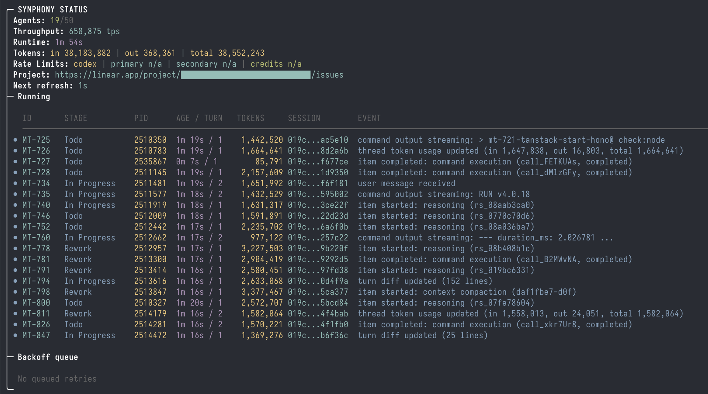

# Symphony Elixir

This directory contains the current Elixir/OTP implementation of Symphony, based on
[`SPEC.md`](../SPEC.md) at the repository root.

> [!WARNING]
> Symphony Elixir is prototype software intended for evaluation only and is presented as-is.
> We recommend implementing your own hardened version based on `SPEC.md`.

## Screenshot



## How it works

1. Polls Linear for candidate work
2. Creates a workspace per issue
3. Launches Codex in [App Server mode](https://developers.openai.com/codex/app-server/) inside the
   workspace
4. Sends a workflow prompt to Codex
5. Keeps Codex working on the issue until the work is done

During app-server sessions, Symphony also serves a client-side `linear_graphql` tool so that repo
skills can make raw Linear GraphQL calls.

If a claimed issue moves to a terminal state (`Done`, `Closed`, `Cancelled`, or `Duplicate`),
Symphony stops the active agent for that issue and cleans up matching workspaces.

## How to use it

1. Make sure your codebase is set up to work well with agents: see
   [Harness engineering](https://openai.com/index/harness-engineering/).
2. Get a new personal token in Linear via Settings → Security & access → Personal API keys, and
   set it as the `LINEAR_API_KEY` environment variable.
3. Copy this directory's `WORKFLOW.md` to your repo.
4. Copy any repo-local worker skills your workflow depends on to `.agents/skills/`.
   - Symphony bundles the generic `commit`, `push`, `pull`, `land`, `linear`, and `debug` skills,
     and syncs them into every configured `codex.accounts[*].codex_home` on startup.
   - The `linear` skill expects Symphony's `linear_graphql` app-server tool for raw Linear GraphQL
     operations such as comment editing or upload flows.
5. Customize the copied `WORKFLOW.md` file for your project.
   - Set exactly one Linear polling scope: `tracker.project_slug` for project-scoped polling or
     `tracker.team_key` for team-scoped polling.
   - `tracker.assignee` is optional and narrows dispatch to issues assigned to a specific Linear
     user id, email, or name (or `me` via `LINEAR_ASSIGNEE`). Use it when a team-scoped worker
     must ignore work owned by other runners.
   - To get your project's slug, right-click the project and copy its URL. The slug is part of the
     URL.
   - When creating a workflow based on this repo, note that it depends on non-standard Linear
     issue statuses: "Rework", "In Review", and "Merging". You can customize them in
     Team Settings → Workflow in Linear.
   - Orchestrator failure escalation uses `tracker.manual_intervention_state` (default: `Blocked`).
6. Follow the instructions below to install the required runtime dependencies and start the service.

## This Repository's Target-Repo Contract

`maximlafe/symphony` can run as its own Symphony target repo. The dedicated LetterL project slug is
`symphony-bd5bc5b51675`, the repo-local worker skills live in `../.agents/skills/`, and the repo
root exposes the worker contract:

- `make symphony-preflight`
- `make symphony-bootstrap`
- `make symphony-dashboard-checks`
- `make symphony-handoff-check`
- `make symphony-validate`
- `make symphony-live-e2e`

Use those root targets instead of ad-hoc shell history when validating a fresh clone or a new
runtime host.

The production runtime contract now lives alongside the app:

- `deploy/docker/README.md`
- `deploy/docker/compose.env.example`
- `deploy/docker/symphony.runtime.env.example`
- `.github/workflows/release-image.yml`
- `.github/workflows/deploy-production.yml`

For isolated smoke tickets in the dedicated `Symphony` project, keep the Linear assignee empty
unless you intentionally route the run through an assignee-filtered worker. This avoids accidental
pickup by a separate team-scoped worker that is filtering on `tracker.assignee`.

## Prerequisites

We recommend using [mise](https://mise.jdx.dev/) to manage Elixir/Erlang versions.

```bash
mise install
mise exec -- elixir --version
```

## Run

```bash
git clone https://github.com/openai/symphony
cd symphony
make symphony-bootstrap
cd elixir
mise exec -- mix build
mise exec -- ./bin/symphony ./WORKFLOW.md
```

`make symphony-bootstrap` is the repo-root unattended bootstrap contract for this repository. It is
safe to rerun in a fresh or already-prepared workspace and should not leave tracked changes behind
after a successful run.

## Configuration

Pass a custom workflow file path to `./bin/symphony` when starting the service:

```bash
./bin/symphony /path/to/custom/WORKFLOW.md
```

If no path is passed, Symphony defaults to `./WORKFLOW.md`.

Optional flags:

- `--logs-root` tells Symphony to write logs under a different directory (default: `./log`)
- `--port` also starts the Phoenix observability service (default: disabled)

The `WORKFLOW.md` file uses YAML front matter for configuration, plus a Markdown body used as the
Codex session prompt.

Minimal example:

```md
---
tracker:
  kind: linear
  # Set exactly one of project_slug or team_key.
  project_slug: "..."
workspace:
  root: ~/code/workspaces
  cleanup_keep_recent: 5
  warning_threshold_bytes: 10737418240
hooks:
  after_create: |
    git clone git@github.com:your-org/your-repo.git .
agent:
  max_concurrent_agents: 10
  max_turns: 20
codex:
  command: codex app-server
  planning_command: codex --config model_reasoning_effort=xhigh app-server
  implementation_command: codex --config model_reasoning_effort=high app-server
  handoff_command: codex --config model_reasoning_effort=medium app-server
---

You are working on a Linear issue {{ issue.identifier }}.

Title: {{ issue.title }} Body: {{ issue.description }}
```

Notes:

- If a value is missing, defaults are used.
- Linear polling scope is mutually exclusive: configure exactly one of `tracker.project_slug` or
  `tracker.team_key`.
- `tracker.assignee` is independent from polling scope. When set, Symphony dispatches only issues
  assigned to that Linear user id/email/name (or the current viewer for `me`), and unassigned
  issues are skipped by that worker.
- The prompt body is the workflow contract. In production, make handoffs explicit with `checkpoint_type` and `risk_level`, define low-context behavior, and cap repeated auto-fix loops so the agent escalates instead of spinning.
- Issue labels are available to both the workflow prompt and hooks, so routing labels can stay separate from orthogonal delivery policies such as `delivery:tdd`.
- `codex.planning_command`, `codex.implementation_command`, and `codex.handoff_command` let the workflow choose different reasoning profiles per phase. In the repo's own workflow, planning stays on `xhigh`, implementation defaults to `high`, and `Merging`/handoff uses `medium`; label `reasoning:implementation-xhigh` is the explicit opt-in to escalate a hard implementation or CI-debug task back to the `xhigh` path.
- If unattended runs create branches or PRs, encode the naming convention explicitly in the prompt instead of relying on tracker-generated branch names; for example, honor an explicit `Working branch:` line in the issue description's final `## Symphony` section when present, otherwise fall back to `Symphony/<issue-id>-<short-kebab-summary>` for branches and `<ISSUE-ID>: <short outcome>` for PR titles.
- Safer Codex defaults are used when policy fields are omitted:
  - `codex.approval_policy` defaults to `{"reject":{"sandbox_approval":true,"rules":true,"mcp_elicitations":true}}`
  - `codex.thread_sandbox` defaults to `workspace-write`
  - `codex.turn_sandbox_policy` defaults to a `workspaceWrite` policy rooted at the current issue workspace
- Supported `codex.approval_policy` values depend on the targeted Codex app-server version. In the current local Codex schema, string values include `untrusted`, `on-failure`, `on-request`, and `never`, and object-form `reject` is also supported.
- Supported `codex.thread_sandbox` values: `read-only`, `workspace-write`, `danger-full-access`.
- When `codex.turn_sandbox_policy` is set explicitly, Symphony passes the map through to Codex
  unchanged. Compatibility then depends on the targeted Codex app-server version rather than local
  Symphony validation.
- `agent.max_turns` caps how many back-to-back Codex turns Symphony will run in a single agent
  invocation when a turn completes normally but the issue is still in an active state. Default: `20`.
- If the Markdown body is blank, Symphony uses a default prompt template that includes the issue
  identifier, title, and body.
- Use `hooks.after_create` to bootstrap a fresh workspace. For a Git-backed repo, you can run
  `git clone ... .` there, then call the repo-owned bootstrap entrypoint such as
  `make symphony-bootstrap`.
- `workspace.cleanup_keep_recent` controls only retention of completed issue workspaces inside
  `workspace.root`; it is not a shared `/tmp` cleanup mechanism. Default: `5`.
- Terminal-state issue cleanup always removes default task-scoped external artifacts that match
  `/tmp/symphony-<ISSUE>-*` and `/var/tmp/symphony-<ISSUE>-*`, and removes the exact issue
  workspace only when it falls outside the retained `workspace.cleanup_keep_recent` window.
- External temporary artifacts that should be safe for automatic per-task cleanup must use the
  `symphony-<ISSUE>-...` naming contract. Additional external paths are eligible only when the
  cleanup caller passes an explicit issue-namespaced path and Symphony validates it against allowed
  root prefixes.
- `before_remove` remains a workspace-scoped hook for the exact issue workspace only; it is not a
  general shared-path cleanup hook.
- `Merging` remains an active state and does not trigger terminal cleanup.
- Shared runtime areas such as `.codex-runtime/homes/*/.tmp` stay outside this per-task cleanup
  scope and are excluded from workspace-root usage accounting.
- Managed runtime-home reuse opportunistically prunes stale `.tmp/plugins-clone-*` directories
  inside the prepared shared runtime home via TTL-based cleanup.
- `workspace.warning_threshold_bytes` sets the workspace-root disk-usage threshold that triggers a
  runtime warning and dashboard highlight. Default: `10737418240` bytes (`10 GiB`).
- Workspace hooks receive issue metadata in environment variables such as
  `SYMPHONY_ISSUE_IDENTIFIER`, `SYMPHONY_ISSUE_TITLE`, `SYMPHONY_ISSUE_DESCRIPTION`,
  `SYMPHONY_ISSUE_PROJECT_SLUG`, `SYMPHONY_ISSUE_PROJECT_NAME`, `SYMPHONY_ISSUE_LABELS`,
  `SYMPHONY_ISSUE_STATE`, `SYMPHONY_ISSUE_BRANCH_NAME`, and `SYMPHONY_ISSUE_URL`.
- In this repository, `hooks.after_create` intentionally ends with `make symphony-bootstrap` so a
  clean workspace clone picks up the same git auth and `mise` bootstrap path every time.
- If a hook needs `mise exec` inside a freshly cloned workspace, trust the repo config and fetch
  the project dependencies in `hooks.after_create` before invoking `mise` later from other hooks.
- `tracker.api_key` reads from `LINEAR_API_KEY` when unset or when value is `$LINEAR_API_KEY`.
- For path values, `~` is expanded to the home directory.
- For env-backed path values, use `$VAR`. `workspace.root` resolves `$VAR` before path handling,
  while `codex.command` stays a shell command string and any `$VAR` expansion there happens in the
  launched shell.
- Multi-account Codex failover is optional. Keep one shared `codex.command`, and define account
  homes under `codex.accounts`. Each account is a pre-authenticated `CODEX_HOME`; Symphony does
  not copy or manage auth tokens.
- When `codex.accounts` is configured, Symphony probes all accounts on startup, when no active
  account is available, and during rare idle full reconciles. Between those reconciles, idle poll
  cycles re-check only the currently active account via `account/read`, preserve the last full
  rate-limit snapshot, and then launch new Codex work under the first healthy account in config
  order.
- Health requires all configured `codex.monitored_windows_mins` to be present in the upstream Codex
  rate-limit payload and to have at least `codex.minimum_remaining_percent` remaining. Defaults:
  `5` percent minimum across `[300, 10080]` minute windows.
- Running sessions stay on the account they started with. Only new starts and retries move to a new
  account after failover or recovery.

```yaml
tracker:
  api_key: $LINEAR_API_KEY
workspace:
  root: $SYMPHONY_WORKSPACE_ROOT
  cleanup_keep_recent: 5
  warning_threshold_bytes: 10737418240
hooks:
  after_create: |
    git clone --depth 1 "$SOURCE_REPO_URL" .
codex:
  command: "$CODEX_BIN app-server --model gpt-5.3-codex"
```

```yaml
codex:
  command: codex app-server
  accounts:
    - id: primary
      codex_home: ~/.codex-primary
    - id: backup
      codex_home: $CODEX_HOME_BACKUP
  minimum_remaining_percent: 5
  monitored_windows_mins: [300, 10080]
```

- `accounts[*].id` is only a local label. Public repos should prefer opaque names such as
  `primary` and `backup` instead of personal email addresses.

- The observability snapshot/API now exposes `active_codex_account_id`, per-account
  `codex_accounts`, and `codex_account_id` on each running session. The top-level `rate_limits`
  field remains the active account's current snapshot for backward compatibility.

- If `WORKFLOW.md` is missing or has invalid YAML at startup, Symphony does not boot.
- If a later reload fails, Symphony keeps running with the last known good workflow and logs the
  reload error until the file is fixed.
- `server.port` or CLI `--port` enables the optional Phoenix LiveView dashboard and JSON API at
  `/`, `/api/v1/state`, `/api/v1/<issue_identifier>`, and `/api/v1/refresh`.
- The terminal dashboard renders only when Symphony has an ANSI-capable terminal. Non-TTY runtimes
  still expose the web dashboard and JSON API without continuously writing ANSI frames to stdout.
- `/api/v1/state` always includes a top-level `release` block that echoes the runtime
  `SYMPHONY_RELEASE_SHA`, `SYMPHONY_IMAGE_TAG`, and `SYMPHONY_IMAGE_DIGEST` values as
  `git_sha`, `image_tag`, and `image_digest`; missing env values are reported as `null`.
- The production deploy path syncs the checked-in Docker Compose contract to the remote host on
  every deploy, so runtime env additions in `deploy/docker/docker-compose.yml` no longer depend on
  a manual host-side copy.
- Set `server.path` when the dashboard is served behind a reverse-proxy path prefix such as
  `/proxy/symphony`; Symphony still serves upstream requests at `/` while generating prefixed
  LiveView and static asset URLs for the proxied mount point.

## Web dashboard

The observability UI now runs on a minimal Phoenix stack:

- LiveView for the dashboard at `/`
- JSON API for operational debugging under `/api/v1/*`
- Bandit as the HTTP server
- Phoenix dependency static assets for the LiveView client bootstrap

### Hosted dashboard behind nginx

The versioned reverse-proxy contract for `https://stream.cash/proxy/symphony/` lives in
`deploy/nginx/stream.cash.symphony-proxy.conf`.

It assumes the local Symphony runtime already matches the `LET-286` bootstrap contract:

- `server.host: 0.0.0.0`
- `server.path: /proxy/symphony`
- `server.port: 4101`

Use `deploy/nginx/README.md` for the `stream.cash` include/apply procedure and
`make symphony-nginx-proxy-contract` to validate the committed include from any repo clone.
Run `make symphony-nginx-proxy-smoke` only on hosts that already have `nginx` installed, or with
`NGINX_BIN` pointing at an executable nginx binary, when you want the disposable runtime replay for
the HTTP path rewrite plus websocket upgrade flow.

## Project Layout

- `lib/`: application code and Mix tasks
- `test/`: ExUnit coverage for runtime behavior
- `WORKFLOW.md`: in-repo workflow contract used by local runs
- `../.codex/`: repository-local Codex skills and setup helpers

## Testing

```bash
make all
```

Run the real external end-to-end test only when you want Symphony to create disposable Linear
resources and launch a real `codex app-server` session:

```bash
cd elixir
export LINEAR_API_KEY=...
make e2e
```

Optional environment variables:

- `SYMPHONY_LIVE_LINEAR_TEAM_KEY` defaults to `SYME2E`
- `SYMPHONY_LIVE_CODEX_COMMAND` defaults to `codex app-server`

The live test creates a temporary Linear project and issue, writes a temporary `WORKFLOW.md`,
runs a real agent turn, verifies the workspace side effect, requires Codex to comment on and close
the Linear issue, then marks the project completed so the run remains visible in Linear.
`make e2e` fails fast with a clear error if `LINEAR_API_KEY` is unset.

For a deterministic dashboard-focused validation slice that does not depend on a real Codex turn,
run:

```bash
make symphony-dashboard-checks
```

## FAQ

### Why Elixir?

Elixir is built on Erlang/BEAM/OTP, which is great for supervising long-running processes. It has an
active ecosystem of tools and libraries. It also supports hot code reloading without stopping
actively running subagents, which is very useful during development.

### What's the easiest way to set this up for my own codebase?

Launch `codex` in your repo, give it the URL to the Symphony repo, and ask it to set things up for
you.

## License

This project is licensed under the [Apache License 2.0](../LICENSE).
